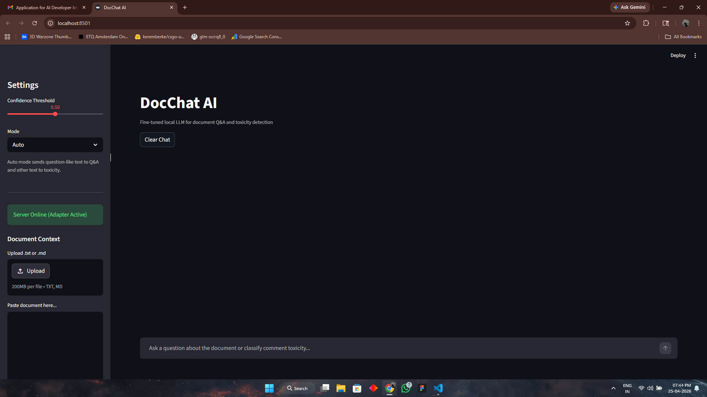
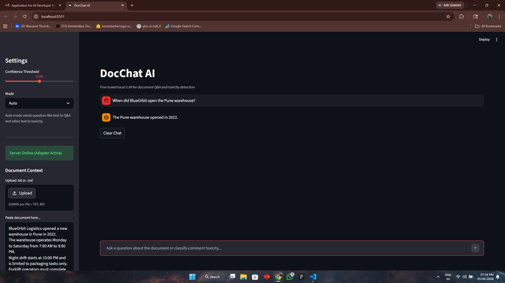
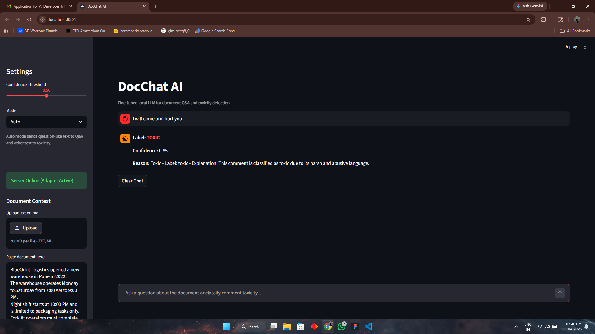

# 1. Project Title
## DocChat AI
Fine-tuned local LLM for document question-answering and toxic comment detection.

# 2. Project Overview
DocChat AI is a fully local AI application that answers questions from user-provided documents and classifies toxic comments with explanations.  
It solves privacy-first document intelligence and moderation use cases without using RAG or vector databases.

# 3. Features
- Document Q&A: answer questions from pasted/uploaded document text.
- Toxic Comment Detection: classify into `toxic`, `severe_toxic`, `obscene`, `threat`, `insult`, `identity_hate`, `safe`, or `unknown`.
- UI Features:
  - Streamlit chat interface
  - Auto mode (routes between Q&A and toxicity)
  - Confidence threshold slider
  - Document upload (`.txt`, `.md`) and paste support
  - Server health indicator
- API Features:
  - Health endpoint
  - Single and batch inference endpoints
  - Input validation, truncation, and fallback handling

# 4. Tech Stack
- Model: `TinyLlama/TinyLlama-1.1B-Chat-v1.0`
- Fine-tuning: LoRA / QLoRA using `peft` + `transformers`
- Backend: FastAPI + Uvicorn
- Frontend: Streamlit
- Core Libraries: `torch`, `datasets`, `evaluate`, `scikit-learn`, `rouge-score`, `requests`
- Package Manager: `uv`

# 5. Folder Structure
```text
DocChat AI/
+-- api.py
+-- ui.py
+-- train.py
+-- evaluate.py
+-- data/
+-- sample_data.json
+-- model_output/          # trained adapters and checkpoints (models/ equivalent)
+-- final_adapter/
+-- pyproject.toml
+-- uv.lock
+-- README.md
```

# 6. Installation Steps
1. Clone the repository.
2. Install dependencies:
```bash
uv sync
```

# 7. How to Run
Start FastAPI server:
```bash
uv run uvicorn api:app --reload
```

Start Streamlit UI (new terminal):
```bash
uv run streamlit run ui.py
```

Run training script (optional):
```bash
uv run train.py
```

# 8. Dataset Information
- Sources:
  - Synthetic Document Q&A samples
  - Toxic comment style samples (Jigsaw-style labels)
- Format:
  - Q&A: `{"doc": "...", "q": "...", "a": "..."}`
  - Toxicity: `{"text": "...", "label": "...", "explanation": "..."}`
- Row Count: 100+ rows (`data/sample_data.json` currently 185 rows)
- Cleaning Steps:
  - Remove corrupted/non-dict rows
  - Skip empty fields
  - Normalize whitespace
  - Keep instruction-tuning format consistency

# 9. Fine-Tuning Process
- Base Model: TinyLlama 1.1B Chat
- Method: LoRA/QLoRA (4-bit quantization on CUDA, fallback path on CPU)
- Typical Config:
  - Epochs: 1
  - Batch size: GPU=1 / CPU=2
  - Gradient accumulation: 4
- Hardware Support:
  - GPU if CUDA-enabled torch is available
  - Graceful CPU fallback otherwise

# 10. API Endpoints
- `POST /ask`  
  Request: `{"document": "...", "question": "..."}`  
  Response: `{"answer": "..."}`

- `POST /predict`  
  Request: `{"comment": "..."}`  
  Response: `{"label": "...", "confidence": 0.0-1.0, "explanation": "..."}`

- `POST /batch_predict` (optional/implemented)  
  Request: `{"comments": ["...", "..."]}`  
  Response: `{"results": [...]}`

- `GET /health`  
  Returns model/adaptor/device status.

# 11. UI Usage
1. Paste or upload a document in the sidebar.
2. Ask a document question in chat.
3. Enter a comment to run toxicity detection.
4. Use mode selector (`Auto`, `Document Q&A`, `Toxicity Detection`) and confidence threshold.

# 12. Evaluation Metrics
Run:
```bash
uv run evaluate.py
```
Metrics included:
- F1 Score (toxicity classification)
- ROUGE-L (Q&A generation quality)
- Accuracy/classification report output from sklearn
- Optional BERTScore (if available)

# 13. Edge Cases Handled
- Empty input text
- Very long document/comment truncation
- Non-English comment handling (`unknown` fallback)
- Server offline/network retry behavior in UI
- Model load failure surfaced via `/health`

# 14. Screenshots

### Home Page


### Q&A Result


### Toxicity Detection Result


# 15. Demo Video
[](demo-vid.mp4)

*Watch the 1-minute demo video above (or [download here](demo-vid.mp4))*
